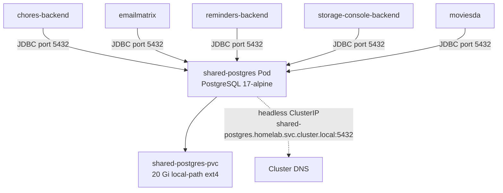

# Shared Postgres — Architecture & Tech Stack

**On this page:** [Deployment diagram](#deployment-diagram) · [What is it](#what-is-it) · [Tech stack](#tech-stack) · [Source code](#source-code) · [Local config files](#local-config-files) · [Data layout](#data-layout) · [Schema namespace](#schema-namespace) · [Design decisions](#design-decisions) · [Why both immich-postgres AND shared-postgres exist](#why-both-immich-postgres-and-shared-postgres-exist) · [Reference](#reference)

## Deployment diagram



## What is it

A vanilla PostgreSQL 17 StatefulSet shared by custom homelab apps (kids tasks, email matrix, future apps). Each app gets its own database and user inside this one instance.

NOT the same as Immich's specialized `immich-postgres` — that one has pgvector + vectorchord extensions for AI vector search, and is intentionally separate.

## Tech stack

| Layer | Tech |
|---|---|
| Database | PostgreSQL 17 (Alpine variant) |
| Image | `postgres:17-alpine` |
| Storage | PVC on `local-path` (VM ext4) — 20 Gi |
| Resource | k8s StatefulSet (1 replica, RWO PVC) |
| Service | Headless ClusterIP (`shared-postgres.homelab.svc.cluster.local:5432`) |
| Auth | Per-DB user + password, stored in Secret |
| Init | One-time init.sh from ConfigMap creates the kids tasks DB |

## Source code

Postgres is **off-the-shelf** — no custom code.

| | |
|---|---|
| Upstream | https://www.postgresql.org/ |
| Docker image | https://hub.docker.com/_/postgres |
| Alpine variant | minimal footprint, ~80MB compressed |

## Local config files

| File | Purpose |
|---|---|
| `~/homelab/shared-postgres.yaml` | StatefulSet + Service + Secret + PVC + Init ConfigMap |
| `docs/configs/shared-postgres.yaml` | Snapshot |

## Data layout

```
/var/lib/postgresql/data/pgdata/      ← inside the pod
├── base/                              ← actual DB data
│   ├── 16384/  (kidstasks)
│   ├── 16395/  (emailmatrix)
│   └── ...
├── pg_wal/                            ← write-ahead log
└── postgresql.conf
```

The PVC `shared-postgres-pvc` mounts this. Lives on local-path (VM ext4), persists across pod/Mac reboots but lost on `orbctl reset`.

## Schema namespace

| Database | App | Owner | Initial seed |
|---|---|---|---|
| `postgres` | superuser maintenance | `postgres` | — |
| `kidstasks` | Chores app | `kidstasks` | (managed by chores app) |
| `emailmatrix` | Email matrix | `emailmatrix` | seeded by Flyway from Excel |

Adding a new app's DB is one CLI command — see [USAGE](USAGE.md).

## Design decisions

- **Single shared instance vs per-app Postgres** — for small homelab apps with low write load, one shared Postgres is far easier to backup, monitor, and maintain. No real performance benefit to per-app instances at this scale.
- **Vanilla Postgres image** — no extensions. If a future app needs `pgvector` etc., either install it in this instance or run a separate Postgres (like Immich does).
- **local-path StorageClass** — VM-internal ext4. Postgres requires POSIX semantics (fsync, atomic rename, file locks) that exFAT-via-FUSE can't provide.
- **Headless Service** — no need for load balancing across replicas (only 1). Direct DNS resolution to the pod.
- **`Recreate` strategy** — RWO PVC can't be mounted by 2 pods simultaneously, so rolling updates would fail. Brief downtime is acceptable for restart.
- **20 Gi PVC** — plenty for small apps. Bump if needed (`kubectl edit pvc shared-postgres-pvc -n homelab` then resize the underlying PV).

## Why both immich-postgres AND shared-postgres exist

Immich requires pgvector + vectorchord extensions for face/object recognition vector search. The image used by Immich (`ghcr.io/immich-app/postgres:17-vectorchord0.4.3-pgvector0.8.0`) is specialized. Mixing vector-heavy workload with general app workload would mean either:
- Adding extensions to shared-postgres (risky for the other apps)
- Or, separating concerns by running two Postgres instances (what we did)

Keeping them separate isolates failure domains too — Immich vector indexing won't impact chores/emailmatrix performance.

## Reference

- Postgres 17 release notes: https://www.postgresql.org/docs/17/release-17.html
- Postgres in Kubernetes patterns: https://www.postgresql.org/docs/current/install-binaries.html
